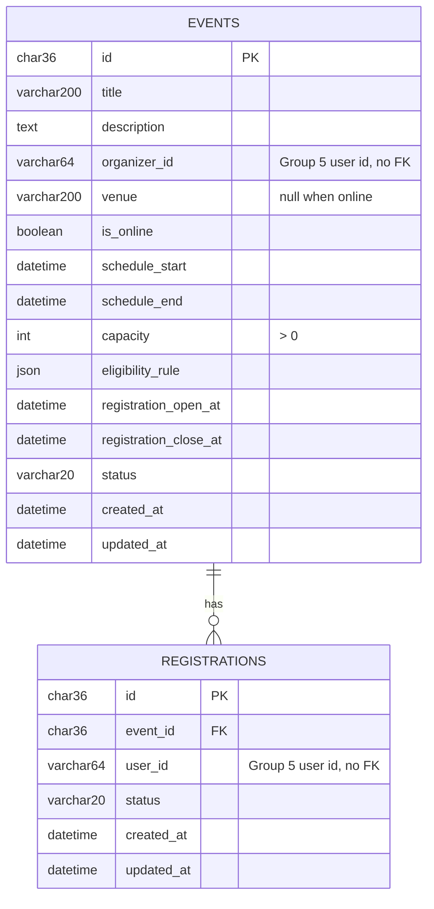

# event-service data dictionary

Database: `event_service_db` (MySQL 8). Owned only by event-service; no other service reads or writes it. Schema changes are made only through Flyway migrations in `src/main/resources/db/migration`.

## ERD

## events

| Column | Type | Notes |
|---|---|---|
| id | CHAR(36) PK | UUID, generated by the service |
| title | VARCHAR(200) NOT NULL | |
| description | TEXT | |
| organizer_id | VARCHAR(64) NOT NULL | Group 5 user id from the token (`sub`), e.g. `usr-organizer-001`. Cross-service reference, so no foreign key |
| venue | VARCHAR(200) | Group 6 resource code (for example LAB-101). Empty for online events. Validated with Group 6 (`GET /api/resources/code/{code}/validate`) when a physical event is published |
| is_online | BOOLEAN NOT NULL | default false |
| schedule_start / schedule_end | DATETIME(6) NOT NULL | end must be after start |
| capacity | INT NOT NULL | CHECK capacity > 0 |
| eligibility_rule | JSON NOT NULL | Who may register, see "Eligibility rule" below. Stored as one JSON column instead of a separate EventEligibility table |
| registration_open_at / registration_close_at | DATETIME(6) NOT NULL | close must be on or before schedule_start |
| status | VARCHAR(20) NOT NULL | see below |
| created_at / updated_at | DATETIME(6) NOT NULL | set automatically |

Indexes: `(status, schedule_start)`.

## registrations

| Column | Type | Notes |
|---|---|---|
| id | CHAR(36) PK | |
| event_id | CHAR(36) NOT NULL | FK to events.id, ON DELETE RESTRICT |
| user_id | VARCHAR(64) NOT NULL | Group 5 user id (`sub`), e.g. `usr-student-001`. No foreign key |
| status | VARCHAR(20) NOT NULL | see below |
| created_at / updated_at | DATETIME(6) NOT NULL | set automatically |

Constraints and indexes: unique `(event_id, user_id)` stops a user registering twice; index `(event_id, status)` is used for capacity counts.

## Status values

| Event status | Meaning | Allowed next |
|---|---|---|
| DRAFT | Being prepared, visible only to the organizer and admin staff | PUBLISHED, CANCELLED |
| PUBLISHED | Visible to everyone, open for registration inside the window | CANCELLED |
| CANCELLED | Called off | none |
| COMPLETED | Finished | none |

| Registration status | Meaning |
|---|---|
| CONFIRMED | Counts toward capacity |
| CANCELLED | User cancelled before the event started |
| WAITLISTED | Reserved for a later sprint, not used yet |

## Eligibility rule

| Rule | Meaning |
|---|---|
| `{"all": true}` | Anyone signed in. Group 5 is not asked |
| `{"roles": ["STUDENT"]}` | User must hold one of the roles |
| `{"roles": ["STUDENT"], "departmentId": "dep-cs"}` | ...and belong to that department |
| `{"facultyId": "fac-sci"}` | User must belong to that faculty (any role) |

Allowed fields: `all`, `roles`, `departmentId`, `facultyId`. Department and faculty values are Group 5 Directory ids, not display names. Any other field is rejected with `INVALID_ELIGIBILITY_RULE`. Group 5 evaluates the rule through `GET /api/v1/validation/users/{userId}/eligibility`; with several roles it is asked once per role until one passes.

## Roles (Group 5 names)

| Action | Roles |
|---|---|
| Create events | EVENT_ORGANIZER, ACADEMIC_STAFF, ADMIN |
| Edit, publish, cancel | Owning EVENT_ORGANIZER / ACADEMIC_STAFF, or ADMIN |
| See all events incl. drafts, overview summary | ADMIN, ADMINISTRATIVE_STAFF |
| Per-event summary | Owner, ADMIN, ADMINISTRATIVE_STAFF |
| Register, cancel own registration | Any signed-in user who passes the eligibility rule |

## Business rules enforced in the service

- Registration needs a PUBLISHED event, an open window, an eligible user (Group 5) and a free seat, checked in that order.
- Capacity is checked under a row lock on the event, so two simultaneous requests cannot take the last seat.
- Only the owning organizer or an ADMIN can edit, publish or cancel an event.
- Only the registration's owner can cancel it, and not after the event has started.

## Demo data

Load it by starting the app with `SPRING_PROFILES_ACTIVE=dev,seed`. It is defined in `src/main/resources/db/seed/R__seed_demo_data.sql`, uses fixed IDs, and is safe to run repeatedly. It contains six events (published physical, published online, draft, full, cancelled, completed) and five registrations. Never enable the `seed` profile in production.
